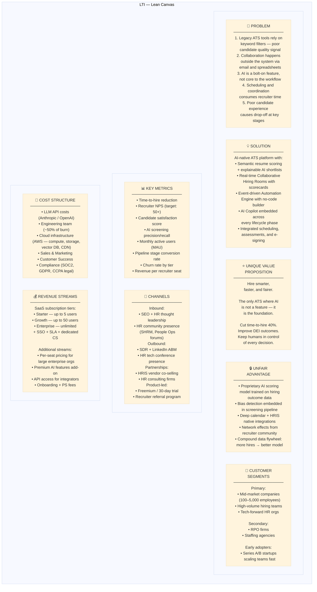
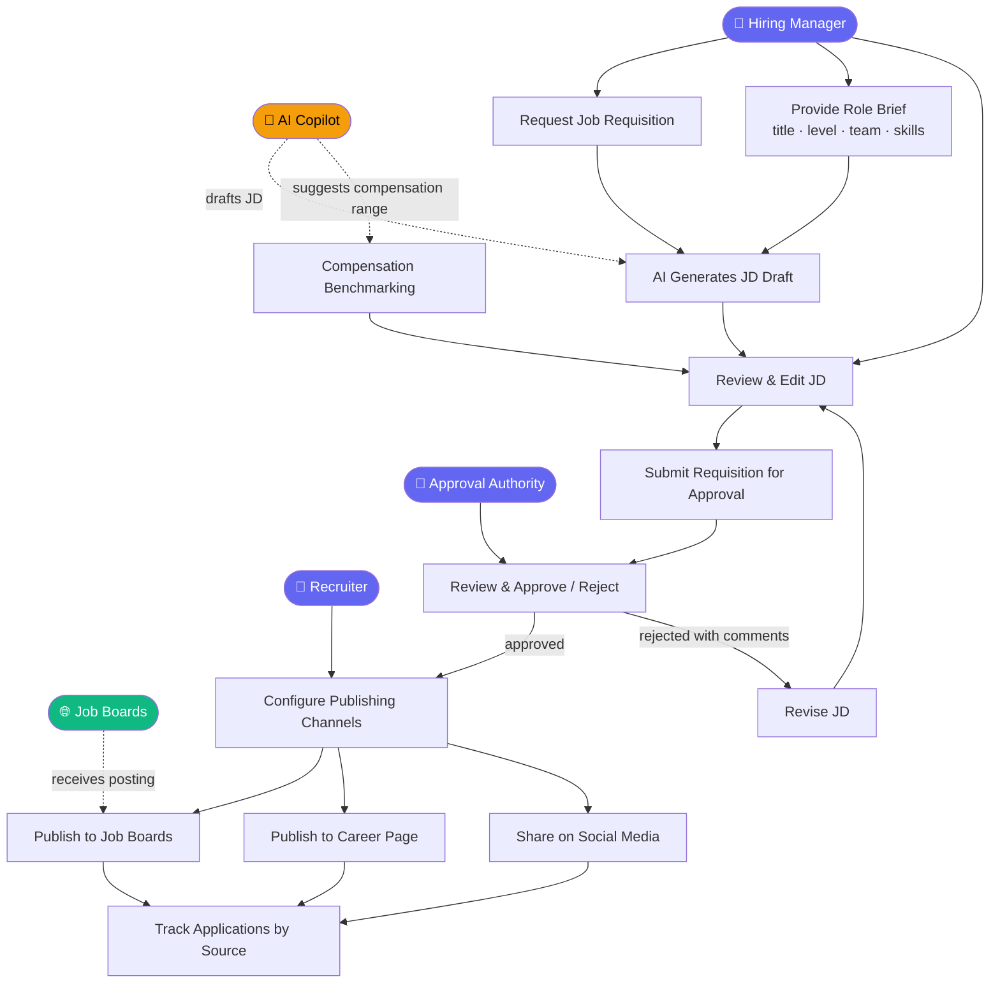
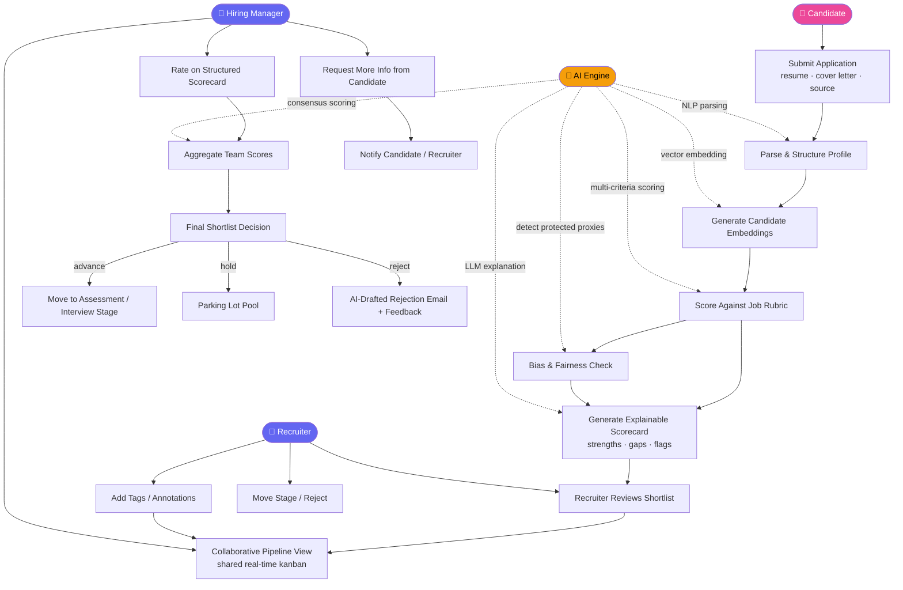
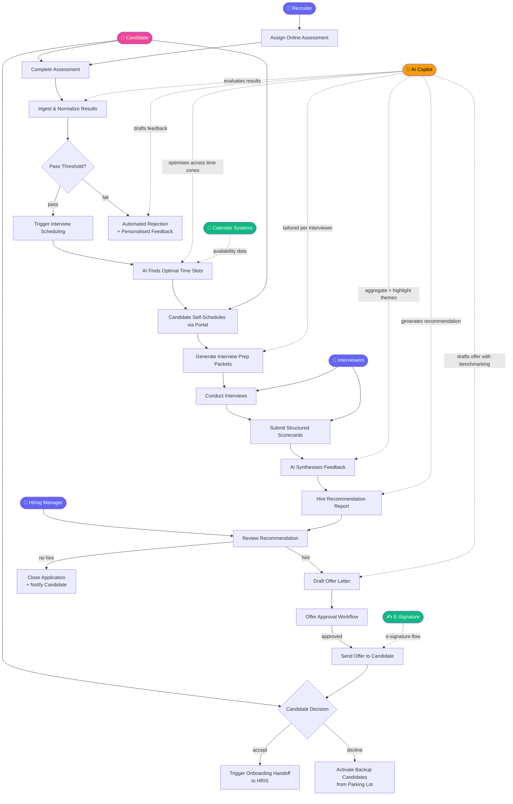
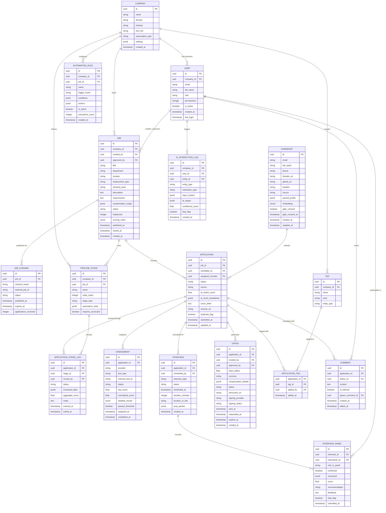
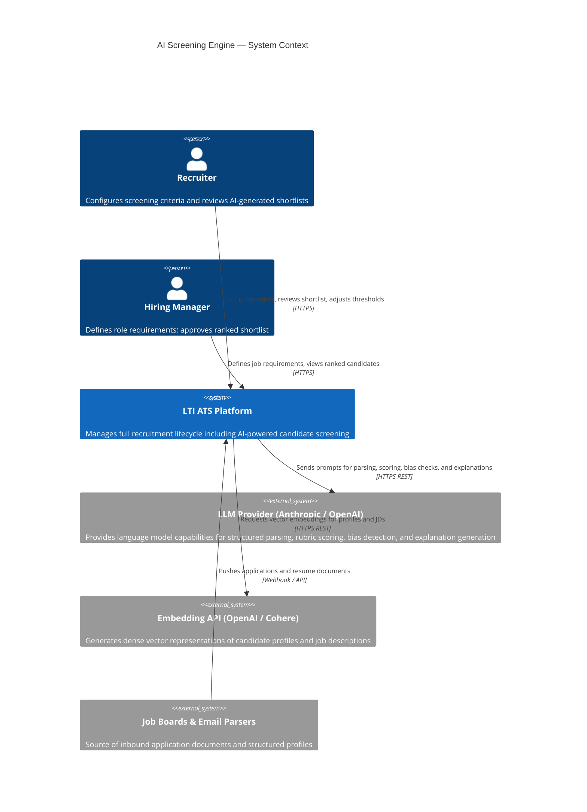
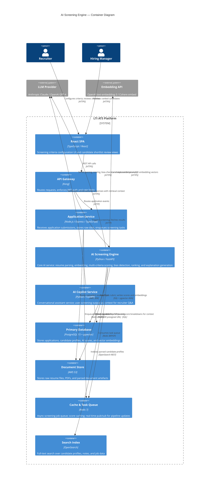
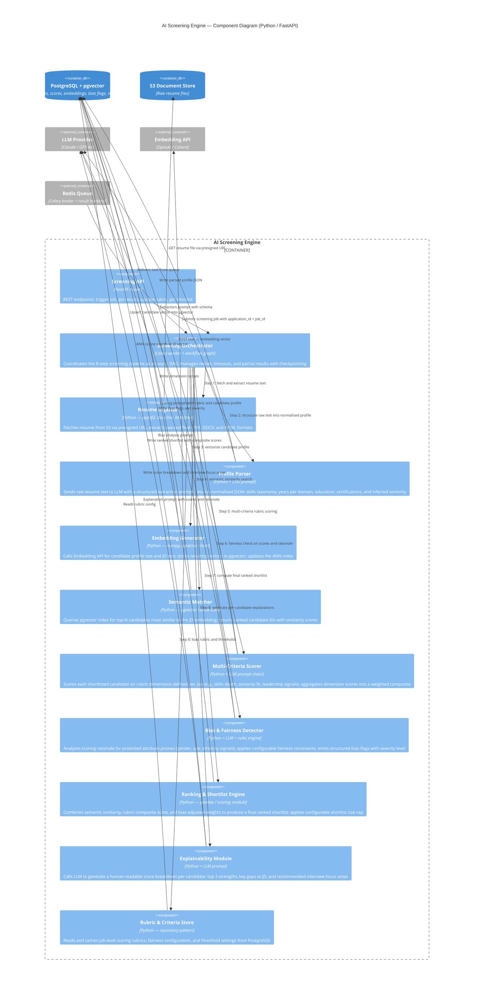

# LTI Talent Tracking System — Design Document

**Document ID:** LTI-AVW  
**Version:** 1.0  
**Date:** April 2026  
**Authors:** LTI Product & Architecture Team

---

## Table of Contents

1. [Product Overview](#1-product-overview)
2. [Main Functions](#2-main-functions)
3. [Business Model — Lean Canvas](#3-business-model--lean-canvas)
4. [Use Cases](#4-use-cases)
5. [Data Model](#5-data-model)
6. [High-Level System Design](#6-high-level-system-design)
7. [C4 Diagram: AI Screening Engine](#7-c4-diagram-ai-screening-engine)

---

## 1. Product Overview

### 1.1 Description

**LTI (Lean Talent Intelligence)** is an AI-native Applicant Tracking System designed for the next generation of talent acquisition. Unlike legacy ATS platforms built on static workflows and keyword filters, LTI is architected around three foundational pillars: **real-time collaboration**, **intelligent automation**, and **deep AI assistance** — empowering HR teams and hiring managers to hire faster, fairer, and smarter.

LTI manages the full recruitment lifecycle as illustrated in the ATS process diagram: from AI-assisted job creation and multi-channel publishing, through application ingestion and AI-powered screening, to interview scheduling, online assessments, collaborative evaluation, and offer management — all in a single deeply integrated platform.

### 1.2 Added Value & Competitive Advantages

| Dimension | Legacy ATS | LTI |
|---|---|---|
| **Screening** | Rule-based keyword filters | AI semantic matching with explainable scores and bias detection |
| **Collaboration** | Email threads and static stage updates | Real-time shared pipeline with inline annotations, @mentions, and scorecards |
| **Automation** | Basic email templates | End-to-end event-driven automation engine with configurable rules |
| **Insights** | Static, periodic reports | Live dashboards with predictive hire quality and pipeline health scores |
| **Candidate Experience** | One-way black-box process | Transparent pipeline with AI-generated feedback at each stage |
| **Integration** | Limited connectors | Native connectors for 50+ job boards, HRIS systems, calendars, and assessment tools |
| **AI** | Bolted-on chatbot | LLM integrated natively across every lifecycle phase |

**Key differentiators:**

- 🤖 **AI Copilot** embedded at every workflow step: JD generation, resume scoring, interview question suggestions, offer drafting, and conversational Q&A on pipeline status.
- 👥 **Collaborative Hiring Rooms** — real-time, async-friendly workspaces where recruiters and hiring managers co-evaluate candidates using structured scorecards and live discussion threads.
- ⚡ **Event-Driven Automation Engine** — a visual rule builder with pre-built recipes that automates repetitive tasks while keeping humans in control of decisions.
- 📊 **Predictive Analytics** — AI models for hire quality prediction, offer acceptance probability, pipeline health scoring, and DEI gap detection.
- 🔍 **Semantic Search** — natural language search across all candidates, resumes, notes, and evaluations using vector embeddings.
- 🛡️ **Fairness by Design** — bias detection is embedded into the AI screening pipeline, not a post-hoc audit step.

---

## 2. Main Functions

### 2.1 Job Management
- AI-assisted job description generation from minimal input (role title, level, team context, required skills)
- Compensation benchmarking recommendations at JD creation time
- Customizable approval workflows for job requisition sign-off
- One-click multi-channel publishing to job boards (LinkedIn, Indeed, Glassdoor, Wellfound), company career pages, and social media
- Job template library with version control and cloning

### 2.2 Application Ingestion & Parsing
- Multi-source application aggregation: direct apply, email parsing, LinkedIn EasyApply, employee referrals, and agency submissions
- AI-powered resume parsing with structured data extraction: skills taxonomy, years of experience per domain, education, certifications, and inferred seniority
- Duplicate candidate detection and automatic profile merging across sources
- GDPR/CCPA-compliant data handling with per-candidate consent tracking and right-to-erasure workflows

### 2.3 AI-Powered Screening
- Semantic matching between candidate profiles and job requirements — goes beyond keyword overlap to understand contextual relevance
- Customizable multi-criteria scoring rubrics per role (e.g., skills depth, culture fit signals, seniority calibration)
- Automated bias detection: flags screening criteria or score rationale that proxies protected attributes
- Shortlist generation with explainable AI scoring: ranked reasons per candidate surfaced to recruiter

### 2.4 Collaborative Review Pipeline
- Kanban-style pipeline view shared in real time across all stakeholders
- Inline commenting, @mentions, reactions, and private notes on candidate profiles
- Structured scorecards per pipeline stage with aggregate team scoring
- Conflict-of-interest detection and recusal workflow for interviewers with prior relationships

### 2.5 Assessments & Tests
- Built-in assessment library: coding challenges, cognitive aptitude, and situational judgment tests
- Third-party assessment integrations: HackerRank, Codility, Pymetrics, and others via webhook
- Automated proctoring hooks and result ingestion
- Assessment result normalization and integration into candidate composite score

### 2.6 Interview Scheduling
- AI-optimized scheduling that cross-checks all interviewer calendars, preferred time zones, and interview load balance
- Self-serve candidate scheduling portal with automated multi-channel reminders
- Panel interview coordination with automatic conflict detection
- AI-generated interview prep packets per interviewer: candidate summary, tailored question suggestions, and scorecard template

### 2.7 Offer Management
- Offer letter generation with integrated compensation benchmarking data
- Configurable offer approval workflows with version tracking
- Digital signing integrations: DocuSign and HelloSign
- Counter-offer and negotiation state tracking
- Backup candidate auto-activation on offer decline

### 2.8 Analytics & Reporting
- Real-time pipeline dashboards: funnel conversion rates, time-to-fill, cost-per-hire, source quality
- DEI metrics tracking and gap analysis per pipeline stage
- Hiring manager and interviewer satisfaction scores (NPS)
- Predictive models: offer acceptance probability, candidate drop-off risk, hire quality forecast

### 2.9 Automation Engine
- Visual no-code workflow builder for custom automation rules
- Pre-built automation recipes (e.g., "Auto-advance if assessment score > 80", "Notify hiring manager when 5 candidates reach final round", "Send rejection if idle > 14 days")
- Event-driven webhook platform for custom integrations
- Audit log of all automated actions with human override capability

### 2.10 AI Copilot
- Contextual assistant available on every screen in the platform
- Capabilities: summarize candidate profile, suggest interview questions, flag profile inconsistencies, draft rejection or offer emails, answer pipeline questions in natural language
- Memory across a hiring cycle: Copilot retains context of prior candidate evaluations within a job

---

## 3. Business Model — Lean Canvas

---

## 4. Use Cases

The three core use cases map directly to the most critical phases of the ATS lifecycle: job creation and publishing, collaborative application review, and interview-to-hire closing.

---

### 4.1 Use Case 1 — AI-Assisted Job Creation & Multi-Channel Publishing

**Description:** A hiring manager initiates a job requisition. The AI Copilot assists in drafting the job description using the role brief as input. The draft goes through a configurable approval workflow before the recruiter publishes it simultaneously to multiple job boards and the company career page. The system then tracks application volume per channel.

**Primary Actor:** Hiring Manager  
**Supporting Actors:** Recruiter, Approval Authority (HR Director), AI Copilot, External Job Boards

---

### 4.2 Use Case 2 — Collaborative Application Review with AI Screening

**Description:** Applications received from multiple sources are parsed and ingested. The AI Screening Engine scores and ranks candidates against the job's rubric, returning an explainable shortlist with bias flags. Recruiters and hiring managers then collaborate in a shared pipeline view, using structured scorecards and inline discussion to advance, hold, or reject candidates.

**Primary Actor:** Recruiter  
**Supporting Actors:** Candidate, Hiring Manager, AI Screening Engine

---

### 4.3 Use Case 3 — Assessment, Interview Scheduling & Hire Decision

**Description:** A shortlisted candidate is assigned an online assessment. On passing, the AI Scheduling Engine finds optimal interview slots across all required interviewers. The candidate self-schedules. Each interviewer receives an AI-generated prep packet. After interviews, structured scorecards feed an AI-synthesized hire recommendation. Upon approval, an offer is drafted, routed through an approval workflow, and sent digitally for signature.

**Primary Actor:** Recruiter  
**Supporting Actors:** Candidate, Hiring Manager, Interviewers, AI Copilot, Calendar Systems, E-Signature Provider

---

## 5. Data Model

The data model covers all core entities across the LTI ATS lifecycle. The primary relationship chain is: **Company → User → Job → Application → Candidate → Pipeline Stage → Interview → Offer**. Supporting entities handle AI interactions, automation rules, and collaboration artifacts.

---

## 6. High-Level System Design

### 6.1 Architectural Overview

LTI follows a **cloud-native, domain-driven microservices architecture** deployed on AWS. A React/TypeScript SPA and progressive mobile web app communicate with backend services through a unified API Gateway. Six core domain services reflect the natural subdomains of the recruitment lifecycle. An AI Services Layer provides screening, copilot, embedding, and automation capabilities as independently scalable services. An event bus (AWS EventBridge) powers asynchronous workflows across all domains.

### 6.2 Key Architectural Decisions

| Decision | Choice | Rationale |
|---|---|---|
| **API surface** | API Gateway (Kong) | Unified auth, rate limiting, and routing across all microservices |
| **Service decomposition** | Domain-driven microservices | Independent scaling; the AI Screening Service requires GPU instances during bulk ingestion |
| **Async workflows** | AWS EventBridge | Decoupled automation triggers; reliable event replay and audit trail |
| **Primary datastore** | PostgreSQL + pgvector | Relational integrity + native vector similarity search for semantic candidate matching |
| **Cache & queue** | Redis | Session management, job queue for async screening tasks, real-time pub/sub |
| **Document storage** | AWS S3 + presigned URLs | Secure, scalable storage for resumes and offer documents |
| **Real-time collaboration** | WebSocket Service | Low-latency pipeline updates, live annotations, @mention notifications |
| **Search** | OpenSearch | Full-text search across candidate profiles, notes, and job history |
| **LLM access** | Abstracted LLM Service | Provider-agnostic; switch between Anthropic, OpenAI, and AWS Bedrock without service changes |

### 6.3 Architecture Diagram

```mermaid
graph TB
    subgraph CLIENT["🖥️ Client Layer"]
        WEB["React / TypeScript SPA"]
        MOB["Mobile PWA"]
    end

    subgraph EDGE["🌐 Edge & Gateway Layer"]
        CDN["CloudFront CDN\n(static assets)"]
        GW["API Gateway — Kong\n(auth · rate limiting · routing)"]
        AUTH["Auth Service\nOAuth2 / JWT / SSO"]
        WSS["WebSocket Service\n(real-time collab)"]
    end

    subgraph CORE["⚙️ Core Domain Services"]
        JS["Job Service\nJob CRUD · Approvals\nTemplates · Publishing"]
        AS["Application Service\nIngestion · Parsing\nDedup · Source Tracking"]
        PS["Pipeline Service\nStages · Scorecards\nCollaboration · Tags"]
        IS["Interview Service\nScheduling · Panels\nPrep Packets · Reminders"]
        OS["Offer Service\nDrafting · Approvals\nSigning · Onboarding"]
        NS["Notification Service\nEmail · In-app · Slack · SMS"]
    end

    subgraph AI_LAYER["🤖 AI Services Layer"]
        SCR["AI Screening Engine\nParsing · Embedding · Scoring\nRanking · Bias Detection"]
        COP["AI Copilot Service\nJD Gen · Summaries\nQ&A · Email Drafting"]
        EMB["Embedding Service\nProfile Vectors\nSemantic Search Index"]
        AUT["Automation Engine\nRule Builder · Triggers\nRecipes · Audit Log"]
    end

    subgraph DATA["🗄️ Data Layer"]
        PG[("PostgreSQL\n+ pgvector\nCore relational data\n+ vector index")]
        RD[("Redis\nCache + Job Queue\n+ Pub/Sub")]
        S3[("AWS S3\nResumes · Documents\nOffer Letters")]
        ES[("OpenSearch\nFull-text search")]
    end

    subgraph INTEGRATIONS["🔗 External Integrations"]
        JB["Job Boards\nLinkedIn · Indeed\nGlassdoor · Wellfound"]
        CAL["Calendars\nGoogle · Outlook\nCal.com"]
        HRIS["HRIS Systems\nWorkday · BambooHR\nRippling"]
        ASSESS["Assessments\nHackerRank · Codility\nPymetrics"]
        SIGN["E-Signature\nDocuSign · HelloSign"]
        LLM["LLM Providers\nAnthropic Claude\nOpenAI · AWS Bedrock"]
    end

    subgraph OBS["📊 Observability"]
        LOG["CloudWatch\nLogs"]
        MET["Datadog\nMetrics + APM"]
        TRC["OpenTelemetry\nDistributed Tracing"]
    end

    WEB & MOB --> CDN
    CDN --> GW
    WEB & MOB <--> WSS

    GW --> AUTH
    GW --> JS & AS & PS & IS & OS & NS

    AS --> SCR
    PS --> COP
    JS --> COP
    IS --> COP
    OS --> COP

    SCR & COP --> EMB
    AUT --> JS & AS & PS & IS & NS

    JS & AS & PS & IS & OS --> PG
    SCR & EMB --> PG
    AS --> S3
    AS & PS --> RD
    AS & PS --> ES

    JS --> JB
    IS --> CAL
    OS --> SIGN
    AS --> ASSESS
    PS --> HRIS

    SCR & COP & EMB --> LLM

    CORE --> LOG & MET & TRC
    AI_LAYER --> LOG & MET & TRC
```

---

## 7. C4 Diagram: AI Screening Engine

The **AI Screening Engine** is LTI's most technically differentiated component. It is responsible for parsing incoming resumes, generating semantic embeddings, scoring candidates against job rubrics, detecting potential bias in scoring rationale, and returning ranked shortlists with explainable scores. We detail this component across C4 levels 1–3.

---

### 7.1 C4 Level 1 — System Context

---

### 7.2 C4 Level 2 — Container Diagram

---

### 7.3 C4 Level 3 — Component Diagram (AI Screening Engine)

---

*Document: **LTI-AVW v1.0** — LTI Talent Tracking System Design*  
*Generated: April 2026 | All diagrams rendered with Mermaid*
